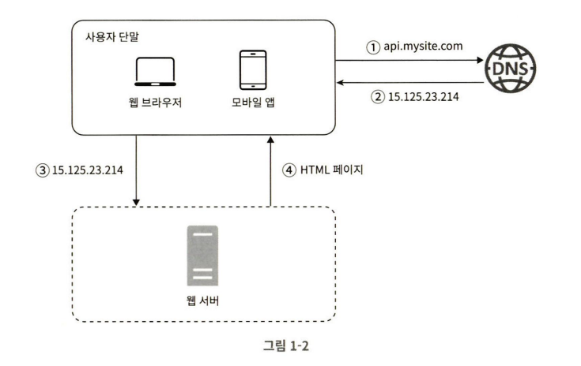
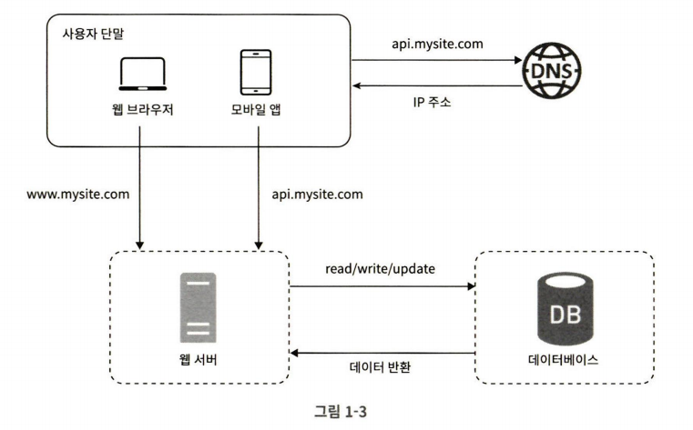
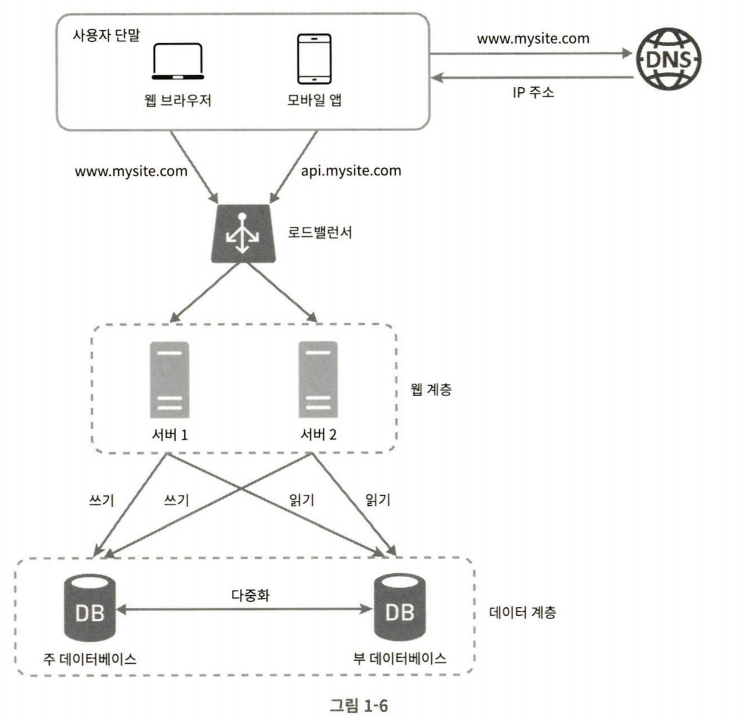
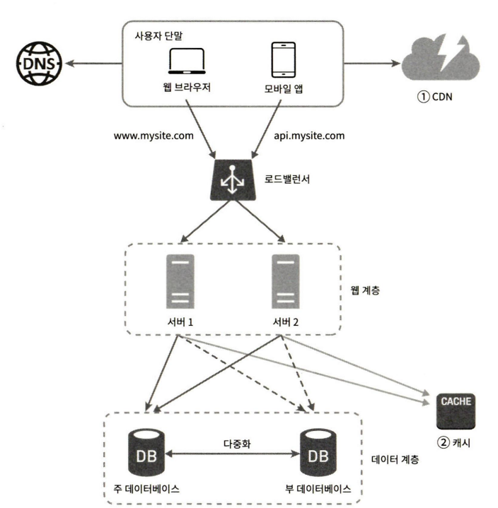
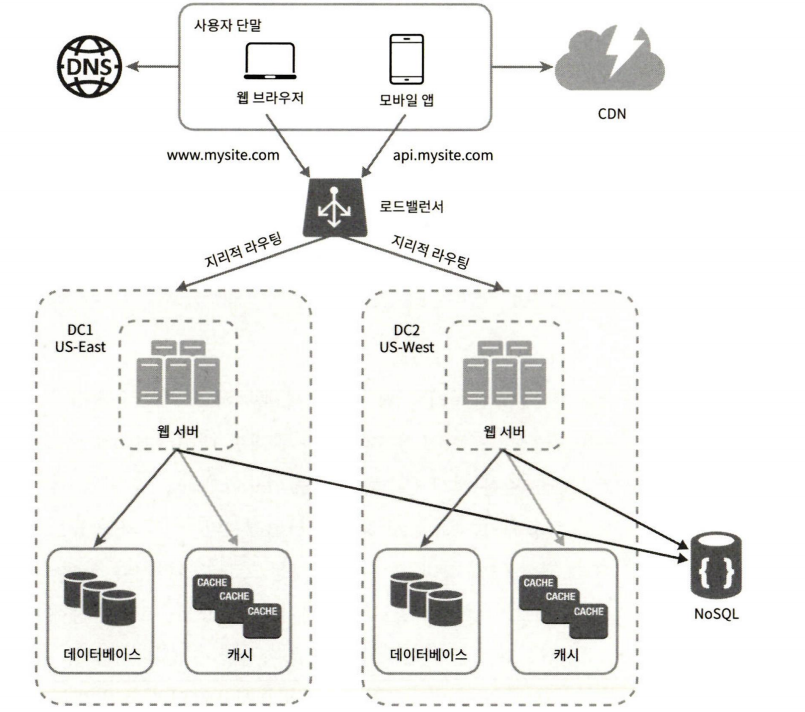

# 1장: 사용자 수에 따른 규모 확장성

> 발표자: [소태호] / 도우미 : [Gemini 2.5 Pro]

## 🤔 왜 규모 확장성이 필요한가?
사용자 수가 늘어남에 따라 어떤 부분을 고민해야 하는 지 살펴보았습니다.   
사용자가 1명일 때부터 수백만이 되면서 발생할 수 있는 설계 문제를 살펴보았습니다.

---

## ⚙️ 핵심 개념 요약

### 1. 단일 서버 (Single Server)
  
가장 기초적인 흐름입니다.  

1. DNS 서버에 질의하여 IP 주소 변환
2. DNS 조회 결과로 IP 주소 반환
3. IP 주소로 HTTP 요청
4. 요청을 받은 웹 서버는 HTML 페이지 / JSON 형태 응답

> 궁금증 1 : 웹 애플리케이션과 모바일 앱의 차이?  
> > 프레젠테이션용 HTML, 자바스크립트를 사용하지 않고 JSON으로 데이터만 보내고, 앱에 있는 UI를 이용한다.  
> 전통적인 웹사이트에서는 페이지를 이동할 때 마다 서버로부터 완전한 HTML 페이지를 받아 렌더링했었지만, 최근에는 필요한 데이터만 JSON 형태로 주고받아 모바일 앱과 유사해졌다.

### 2. 데이터베이스

  

사용자가 늘어나면 서버 하나로는 충분하지 않아 여러 서버를 사용합니다. 사진에서 하나는 웹/모바일 트래픽 처리용도, 나머지는 데이터베이스용입니다.  
트래픽 처리 서버(웹 계층) / 데이터베이스 서버(데이터 계층)으로 나누며 각각 독립적인 확장이 가능해졌습니다.  

#### RDBMS
자료를 테이블과 열, 컬럼으로 표현합니다.  
SQL을 사용하여 여러 테이블을 관계에 따라 조인 연산이 가능합니다.

#### NoSQL
Key - value(고속 읽기/쓰기 처리, 캐싱, 세션 관리),
graph(복잡한 관계망 분석, 추천 시스템, 소셜 네트워크, 사기 탐지 강력), 
column(시계열, 로그, IoT 데이터 관리), 
document(스키마 변경이 잦거나 유연한 데이터 구조에 유리) 4가지 저장방식이 있습니다.

다음의 경우에 비관계형(NoSQL)을 고려해볼 수 있습니다.
- 낮은 응답 지연시간 필요
- 다루는 데이터의 형태가 비정형 데이터
- 데이터를 직렬화/역직렬화할 수 있기만 하면 가능
- 많은 양의 데이터를 저장할 필요가 있음

> 궁금증 2: 많은 양의 데이터 저장은 왜 NoSQL이 유리한가?
> > NoSQL은 수평적 확장(scale-out), RDBMS는 수직적 확장(scale-up)에 유리하기 때문이다.  
> > RDBMS의 경우 분산 환경에서 조인 연산의 성능 저하 및 데이터 일관성(ACID)을 고수하기 어렵다.

### 3. 수직적 규모 확장 vs 수평적 규모 확장

- 수직적 규모 확장(scale-up) : 서버에 고사양 자원(CPU, RAM)을 추가
- 수평적 규모 확장(scale-out) : 많은 서버를 추가

트래픽이 적을 때는 수직적 규모 확장이 단순하여 유리합니다. 다만 한 대의 서버의 자원을 업그레이드 하는 것은
한계가 있으며, 자동복구 방안이나 다중화에 대한 방안이 없습니다.

=> 따라서 우리가 만들고자 하는 대규모 애플리케이션은 수평적 규모 확장법이 적절합니다.  

#### 로드밸런서
로드 밸런서를 이용한다면 웹 계층에서의 트래픽 처리가 가능합니다.
웹 서버로의 클라이언트 요청을 가로 채 트래픽을 적절하게 분산하고, 에러가 발생한 서버로는 요청을 보내지 않는 등
부하 분산 역할을 수행할 수 있습니다.

#### 데이터베이스 다중화
서버 사이에 master - slave 관계를 설정하여 데이터 원본은 master, 사본은 slave에 저장하는 방식입니다.
master는 데이터를 조작하는 명령을 수행하고, slave는 읽기 연산을 지원합니다.  
대다수의 서버가 읽기 연산의 비중이 훨씬 크므로 slave가 더 많습니다. 
많은 slave는 읽기 연산을 병렬로 처리할 수 있어 성능이 좋아집니다.
또한 일부 slave가 없어져도 데이터가 보존됩니다.

  

### 4. 캐시

캐시는 값비싼 연산 결과 또는 자주 참조되는 데이터를 메모리 안에 두고 똑같은 요청을 보다 빨리 처리할 수 있게하는 저장소입니다.
> 캐시 전략
> 1. Cache-Aside (Lazy Loading / Read Through) : 일반적으로 사용되는 전략이다. 애플리케이션이 데이터를 요청하면 캐시에서 먼저 찾고 데이터가 있으면(cache-hit)
반환을 하고 없다면 데이터베이스에서 찾는다.
> 2. Read-Through (Cache-Aside의 변형) : 캐시 라이브러리/프레임워크가 데이터베이스에서
데이터를 가져와 캐시를 채우는 로직을 가지고 있다. 캐시 미스(cache-miss)시 알아서 데이터베이스에서
데이터를 가져와 채운다.
> 3. Write-Through : 데이터를 업데이트할 때 캐시와 데이터베이스에 모두 쓰는 전략이다.
캐시와 데이터베이스의 데이터 일관성을 높일 수 있지만, 두 곳 모두 쓰기를 완료해야 작업이 끝나므로 느리다.
> 4. Write-back : 캐시에만 먼저 데이터를 쓰고, 데이터베이스에는 데이터를 모아서 비동기로 쓴다. 쓰기 속도가 빠르지만
캐시의 내용이 반영되기 전에 캐시가 유실되면 데이터가 유실된다.
> 5. Write-around : 데이터를 쓸 때 캐시를 거치지 않고 데이터베이스에 직접 쓰는 방식이다.
로그 데이터같이 한 번 쓰고 다시 읽지 않을 데이터는 굳이 캐시에 저장할 필요가 없으므로 유용하게 사용된다.

> 캐시 무효화 (Cache Invalidation) 전략  
캐시 무효화는 캐시된 데이터가 최신 상태를 유지하도록 관리한다.
>- Time-To-Live (TTL): 일정 시간(예: 5분)이 지나면 자동으로 캐시에서 데이터를 제거.
>- Least Recently Used (LRU): 가장 오랫동안 사용되지 않은 데이터를 제거.
>- Least Frequently Used (LFU): 가장 적게 사용된 데이터를 제거.
>- Write-Through / Write-Around: 데이터베이스에 쓰기 시 캐시된 데이터를 무효화하거나 업데이트.
>- 메시지 기반 무효화: 데이터베이스 변경 이벤트를 감지하여 관련 캐시 항목을 명시적으로 무효화하는 메시지를 발행.

캐시 사용 시 고려해야하는 점은 다음과 같습니다.
1. 캐시를 사용하기 적절한 상황인가?
2. 어떤 데이터를 캐시에 두어야 하는가?(휘발성 vs 영속성)
3. 캐시 데이터를 어떻게 만료(expired)할 것인가?
4. 일관성은 어떻게 유지되는가?
5. 장애에는 어떻게 대처할 것인가?
6. 캐시 메모리의 크기는 얼마나 크게 잡을 것인가?
7. 데이터 방출 정책은 무엇인가?(LRU, LFU, FIFO...)

> 궁금증 3: 데이터베이스의 크기만큼 캐시도 크게 만들면 되지 않는가?
> > 1. 비용 문제 : 캐시는 RAM을 사용하여 데이터베이스보다 훨씬 비싸다.
> > 2. 휘발성 : 캐시의 데이터는 휘발성이므로 서버가 재시작되거나 장애가 발생하면 데이터가 사라진다.
> > 3. 일관성 : 분산된 캐시 서버들의 데이터 일관성을 실시간으로 유지하는 것은 불가능에 가깝다.
> > 4. 캐시 본래의 목적 상실 : 자주 사용되는 Hot-data를 빠르게 제공하는 게 목적인데
> > 평상시에 볼 일이 없는 로그 데이터같은 cold-data도 보관하는 것은 비효율적이다. 
> 
> 캐시는 빠르지만 비싸고 휘발성이며, 일관성 유지에 추가적인 노력이 필요한 반면, 
> 데이터베이스는 느리지만 저렴하고 영구적이며, 강력한 일관성을 보장한다.
> 이 둘은 서로의 단점을 보완하며 시너지를 내는 관계로, 한 쪽이 다른 쪽의 역할을 완전히 대체할 수는 없다.

### 콘텐츠 전송 네트워크(CDN)
CDN은 정적 콘텐츠를 전송하는 데 쓰이는 지리적으로 분산된 서버의 네트워크입니다.
이미지, 비디오, CSS, javascript 파일등을 캐시할 수 있습니다.
사용자 측에 최대한 가깝게 배치하여 로딩 시간을 개선하는 방식입니다.

> 동적 컨텐츠 캐싱(by NGINX 쿡북)
> > 반면에 대시보드 애플리케이션 화면처럼 어느 정도 변화가 있는 콘텐츠를 캐시할 때는 사용자의 애플리케이션 사용 방식이나 경험치 차이와 같은 정보가 필요합니다.
> 이러한 동적 콘텐츠를 캐싱할 때는 쿠키나 JWT 토큰과 같은 세션 식별자를 활용하는 것이 좋습니다.
> 다만 특정 사용자의 동작을 통해 캐시된 콘텐츠를 상황에 대한 충분한 이해 없이 다른 사용자에게 제공하면 보안 문제를 야기할 수 있습니다.

> 적용 예상  
> 개인 프로젝트 hibi(히비)는 하루에 1곡을 사용자들에게 소개해주는 서비스이다.
> 오늘의 곡 소개 페이지는 날마다 소개하는 곡이 바뀌므로 동적인 컨텐츠 페이지라고 볼 수 있다.
> 다만 하루(24시간)마다 바뀌므로 그렇게 자주 바뀌는 동적 컨텐츠는 아니다.
> 따라서 CDN을 활용하여 사용자가 가장 많이 방문할 것으로 예상되는 오늘의 곡 소개 페이지를 캐시처리 한다면
> 성능 향상이 기대된다.

캐시 서버와 CDN을 활용하여 데이터베이스의 값비싼 연산을 방지하고 반복되는 요청을 더욱 빨리 처리할 수 있게 되었습니다.

### 무상태(stateless) 웹 계층
웹 계층을 수평적으로 확장하기 위해서는 상태 정보(세션)를 웹 계층에서 제거해야 합니다.
사용자의 상태정보는 지속성 저장소에 저장하여 필요할 때 가져오도록 합니다.

> 고정 세션(Sticky session by NGINX 쿡북)
> 1. 스티키 쿠키 : 사용자가 특정 업스트림 서버를 사용하도록 고정한다. nginx 자체에서 고정 세션 구현을 위해 쿠키를 생성한다.
> 2. 스티키 런(learn) : 스티키 쿠키처럼 쿠키를 이용하여 특정 업스트림 서버를 사용하도록 고정한다.
> 차이점은 서버에서 생성하는 응답 헤더를 보고 쿠키를 학습(learn)하여 공유 메모리 영역에 어떤 쿠키를 어떤 업스트림 서버로 보낼지 저장해둔다.
> 3. 스티키 라우팅 : 스티키 쿠키와 스티키 런 방식보다 정교하게 트래픽을 제어할 때 사용한다.
> 어떤 업스트림 서버로 보낼 지는 다양한 매개변수를 활용하여 결정한다.

### 데이터 센터
이제는 전 세계 어디서도 서비스를 쾌적하게 사용할 수 있게 바꿀 차례입니다.
지리적 라우팅을 통해 사용자가 가장 빠르게 서비스를 사용할 수 있는 곳으로 알아서 라우팅해줍니다.

데이터 센터 중 하나가 장애가 발생하면 트래픽은 장애가 없는 다른 데이터 센터로 전송되어야 합니다.

다중 데이터센터 아키텍쳐를 만들기 위해서는 다음과 같은 기술적 문제를 고려해야합니다.
1. 트래픽 우회 : 올바른 데이터 센터로 트래픽을 보내는 효과적인 방법이 필요하다.
2. 데이터 동기화 : 서로 다른 데이터센터를 사용하더라도 똑같은 데이터가 있어야 한다.
3. 테스트와 배포 : 여러 위치에서 테스트해봤을 때 문제없이 작동해야 한다.

### 메시지 큐
메시지 큐는 메시지의 무손실을 보장하는, 비동기 통신을 지원하는 컴포넌트입니다.
메시지의 버퍼 역할을 하며 비동기적으로 전송합니다.

메시지 큐를 이용하는 경우 서비스 또는 서버 간 결합이 느슨해져 규모 확장성이 보장되어야 하는 안정적 애플리케이션을 구성하기 좋습니다.

### 로그, 메트릭, 자동화
로그, 메트릭, 자동화는 웹사이트의 규모가 커지면 필수적으로 구현해야 합니다.
1. 로그 : 로그를 단일 서비스로 모아주는 도구를 활용하면 편리하게 검색 및 조회 가능
2. 메트릭 : 잘 수집하면 운영 현황에 대한 유용한 정보를 얻을 수 있다.
3. 자동화 : CI/CD가 구축이 되어 있다면 문제를 쉽게 감지할 수 있고 개발 생산성이 크게 향상

### 데이터베이스의 규모 확장
저장할 데이터가 많아지면 데이터베이스에 대한 부하도 증가하므로 데이터베이스를 증설할 방법이 필요합니다.
위에서 설명한 수직적 확장, 수평적 확장을 적용가능합니다.

데이터베이스의 수평적 확장은 샤딩이라고도 부릅니다. 대규모 데이터베이스를 샤드라고 부르는 작은 단위로 분할합니다.
모든 샤드는 같은 스키마를 사용하지만 샤드에 보관되는 데이터 사이에는 중복이 없습니다.

샤딩 전략 구현 시 중요한 것은 샤딩 키를 어떻게 결정하느냐 하는 것입니다. 파티션 키라고도 불리는데,
데이터가 어떻게 분산될지 정하는 하나 이상의 컬럼으로 구성됩니다.

샤딩에는 다음과 같은 문제점이 따라옵니다.
1. 재 샤딩 : 데이터가 많아져 하나의 샤드로 감당하기 어렵거나, 샤드 간 데이터 분포가 고르지 못할 때 샤드 키를 계산하는 함수를 변경하고 데이터를 재배치해야 한다.
2. 유명인사 문제 : 핫스팟 키 문제라고도 하며, 특정 샤드에 질의가 집중되어 과부하가 걸리는 문제다.
3. 조인과 비정규화 : 하나의 데이터베이스를 여러 샤드 서버로 쪼개면, 여러 샤드에 걸친 데이터를 조인하기 어렵다.